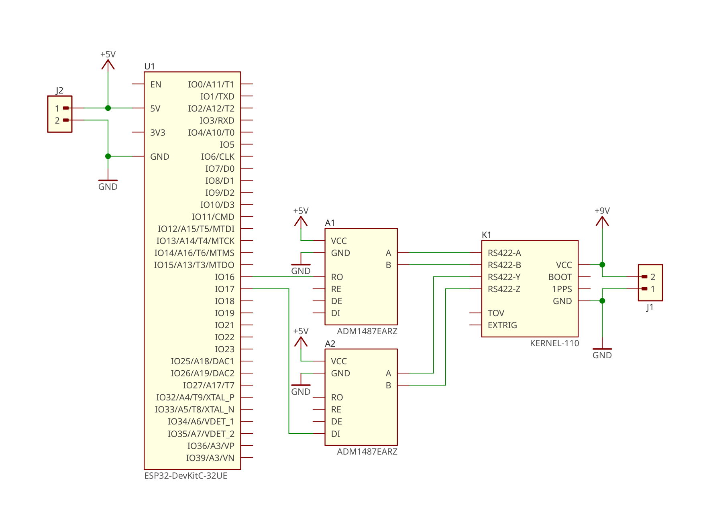

# Kernel IMU Driver

Library for using Inertial Labs® Kernel IMU by ESP32 via serial port

Tested on **Kernel-100** and **Kernel-110** connected via **UART** to **ESP WROOM-32U**

[](https://stand-with-ukraine.pp.ua)

## Pinout



## Debug Logs

To output debug logs by **ESP32**, declare macro **DEBUGLOG** in **platforio.ini** and rebuild sketch

```
[env:esp32dev]
...
build_flags = -Wall -D DEBUGLOG
...
```

